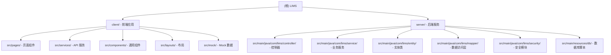

# LIMS - 实验室信息管理系统

> **Laboratory Information Management System**
> 最后更新：2025-12-31 13:26:09

---

## 变更记录 (Changelog)

| 日期 | 内容 | 操作人 |
|------|------|--------|
| 2025-12-31 | 项目 AI 上下文初始化，生成根级与模块级文档 | AI 初始化架构师 |

---

## 项目愿景

基于现代化技术栈打造的企业级实验室信息管理系统，覆盖实验室检测业务全流程：从委托咨询、样品登记、任务分配、检测数据录入、报告生成到财务管理与统计分析。

**核心价值**：
- 业务流程数字化与可追溯
- 检测数据结构化存储与分析
- 三级审批流程保障质量
- 在线报告生成与查验
- 设备与耗材全生命周期管理

---

## 架构总览

### 技术架构

```
┌─────────────────────────────────────────────────────────────┐
│                         LIMS 系统                            │
├─────────────────────────────────────────────────────────────┤
│  前端层 (client/)                                            │
│  ├─ React 19 + TypeScript 5                                 │
│  ├─ Ant Design 6 (UI 组件库)                                │
│  ├─ Vite 7 (构建工具)                                       │
│  ├─ Fortune-sheet (在线表格编辑)                            │
│  ├─ ECharts (数据可视化)                                    │
│  └─ React Router 7 (路由管理)                               │
├─────────────────────────────────────────────────────────────┤
│  后端层 (server/)                                            │
│  ├─ Spring Boot 3.2.0 (Java 17)                             │
│  ├─ Spring Security + JWT (认证授权)                        │
│  ├─ MyBatis-Plus 3.5.5 (ORM 框架)                          │
│  ├─ Knife4j 4.3.0 (API 文档)                                │
│  └─ EasyExcel + LibreOffice (报告导出)                      │
├─────────────────────────────────────────────────────────────┤
│  数据层                                                      │
│  ├─ MySQL 8.0 (主数据库)                                    │
│  ├─ Redis 7 (缓存 + Session)                                │
│  └─ MinIO (文件对象存储)                                    │
├─────────────────────────────────────────────────────────────┤
│  部署层                                                      │
│  ├─ Docker + Docker Compose (容器化)                        │
│  ├─ Nginx (反向代理 + 静态资源)                             │
│  └─ Systemd (进程守护)                                      │
└─────────────────────────────────────────────────────────────┘
```

### 数据模型（核心表）

| 表名 | 说明 | 主要字段 |
|------|------|----------|
| `sys_user` | 用户表 | username, password, dept_id, real_name |
| `sys_role` | 角色表 | role_name, role_code, data_scope |
| `sys_dept` | 部门表 | dept_name, parent_id, ancestors |
| `biz_client` | 客户单位表 | client_name, contact, credit_code |
| `biz_entrustment` | 委托单表 | entrustment_no, client_id, status |
| `biz_contract` | 合同表 | contract_no, entrustment_id, amount |
| `biz_sample` | 样品表 | sample_no, entrustment_id, sample_name |
| `biz_test_task` | 检测任务表 | task_no, sample_id, assignee_id, status |
| `biz_test_data` | 检测数据表 | task_id, test_items (JSON), sheet_data (JSON) |
| `biz_test_report` | 检测报告表 | report_no, entrustment_id, status, approval_status |
| `sys_approval_record` | 审批记录表 | business_type, business_id, current_node_id |
| `biz_device` | 设备表 | device_no, device_name, status, calibration_date |
| `biz_supplier` | 供应商表 | supplier_name, contact, evaluation_score |
| `biz_outsource_order` | 委外单表 | order_no, supplier_id, task_id |
| `fin_receivable` | 应收账款表 | entrustment_id, total_amount, paid_amount |
| `fin_payment` | 收款记录表 | receivable_id, payment_amount, payment_date |
| `fin_invoice` | 发票表 | receivable_id, invoice_no, invoice_amount |

---

## 模块结构图



---

## 模块索引

| 模块路径 | 语言 | 职责 | 入口文件 | 文档 |
|----------|------|------|----------|------|
| **client/** | TypeScript | React 前端应用，提供完整的 LIMS UI 界面 | `src/main.tsx` | [client/CLAUDE.md](./client/CLAUDE.md) |
| **server/** | Java | Spring Boot 后端服务，提供 RESTful API | `src/main/java/com/lims/LimsApplication.java` | [server/CLAUDE.md](./server/CLAUDE.md) |

---

## 运行与开发

### 快速启动（Docker 一键部署）

```bash
# 1. 克隆项目
git clone https://github.com/wangpeng1017/1124lims.git
cd 1124lims

# 2. 启动所有服务（MySQL + Redis + MinIO + 后端 + 前端）
docker-compose up -d

# 3. 访问
# 前端: http://localhost
# 后端 API: http://localhost:8080/api
# API 文档: http://localhost:8080/api/doc.html
# MinIO 控制台: http://localhost:9001
```

### 本地开发模式

```bash
# 1. 启动基础服务
docker-compose up -d mysql redis minio

# 2. 后端开发
cd server
mvn clean install
mvn spring-boot:run
# 访问 http://localhost:8080/api/doc.html

# 3. 前端开发
cd client
npm install
npm run dev
# 访问 http://localhost:5173
```

### 生产部署（阿里云/私有服务器）

```bash
# 环境要求
# - Java 17+
# - Node.js 18+
# - MySQL 8.0 / MariaDB 10.5+
# - Redis 7.0+
# - Nginx
# - LibreOffice 7+ (用于报告生成)

# 1. 克隆代码
git clone https://github.com/wangpeng1017/1124lims.git /root/lims-app
cd /root/lims-app

# 2. 后端构建
cd server
mvn clean package -DskipTests
# 生成 target/lims-server-1.0.0.jar

# 3. 前端构建
cd ../client
npm install --registry=https://registry.npmmirror.com
npm run build
# 生成 dist/

# 4. 初始化数据库
mysql -u root -p < server/src/main/resources/db/init.sql
mysql -u root -p lims < server/src/main/resources/db/data.sql

# 5. 配置环境变量（修改 server/src/main/resources/application.yml）
# - spring.datasource.url/username/password
# - spring.data.redis.host/password
# - minio.endpoint/access-key/secret-key
# - jwt.secret

# 6. 配置 systemd 服务（/etc/systemd/system/lims.service）
[Unit]
Description=LIMS Backend Service
After=network.target mysql.service redis.service

[Service]
Type=simple
User=root
ExecStart=/usr/bin/java -jar /root/lims-app/server/target/lims-server-1.0.0.jar
Restart=on-failure

[Install]
WantedBy=multi-user.target

# 7. 配置 Nginx
server {
    listen 80;
    server_name your-domain.com;

    # 前端静态资源
    location / {
        root /root/lims-app/client/dist;
        try_files $uri $uri/ /index.html;
    }

    # 后端 API
    location /api/ {
        proxy_pass http://localhost:8080;
        proxy_set_header Host $host;
        proxy_set_header X-Real-IP $remote_addr;
    }
}

# 8. 启动服务
systemctl daemon-reload
systemctl start lims
systemctl enable lims
systemctl restart nginx
```

### 默认账号

| 用户名 | 密码 | 角色 | 权限 |
|--------|------|------|------|
| admin | admin123 | 超级管理员 | 全部功能 |

---

## 测试策略

### 前端测试

- **单元测试**：暂未配置（TODO：引入 Vitest）
- **集成测试**：通过 Mock 数据进行开发阶段测试（`src/mock/*.ts`）
- **E2E 测试**：手动测试为主

### 后端测试

- **单元测试**：已配置 Spring Boot Test 框架，但测试用例待补充
- **API 测试**：通过 Knife4j (Swagger UI) 进行手动测试
  - 访问：`http://localhost:8080/api/doc.html`
- **集成测试**：依赖 Docker MySQL/Redis 环境

---

## 编码规范

### 前端规范

- **文件命名**：组件使用 PascalCase (`ClientUnit.tsx`)，工具类使用 camelCase (`pdfExport.ts`)
- **组件规范**：
  - 使用函数组件 + Hooks
  - Props 使用 TypeScript 接口定义
  - 导出前使用 `React.FC` 声明
- **API 调用**：统一封装在 `src/services/` 下
- **状态管理**：使用 React Hooks (useState, useEffect)
- **路由定义**：集中在 `App.tsx`

### 后端规范

- **分层架构**：Controller → Service → Mapper (MyBatis)
- **命名规范**：
  - Controller 统一以 `Controller` 结尾
  - Service 接口无前缀，实现类以 `Impl` 结尾
  - Mapper 接口以 `Mapper` 结尾
- **响应格式**：统一使用 `Result<T>` 封装，包含 code/message/data
- **异常处理**：使用 `@RestControllerAdvice` 全局异常处理器
- **API 文档**：所有接口必须添加 `@Operation` 注解

---

## AI 使用指引

### 开发协作

- **修改代码后**：同步更新对应模块的 `CLAUDE.md`
- **新增功能**：在根 `CHANGELOG.md` 记录变更
- **数据库变更**：在 `server/src/main/resources/db/migration/` 创建迁移脚本

### 常见任务

#### 1. 新增业务模块

```bash
# 后端
1. 创建 Entity (com.lims.entity.NewModule)
2. 创建 Mapper (com.lims.mapper.NewModuleMapper)
3. 创建 Service 接口与实现 (com.lims.service.NewModuleService)
4. 创建 Controller (com.lims.controller.NewModuleController)
5. 添加数据库表 (db/migration/Vyyyymmdd__add_new_module.sql)

# 前端
1. 创建页面组件 (pages/NewModule/index.tsx)
2. 创建 API 服务 (services/newModuleApi.ts)
3. 在 App.tsx 添加路由
4. 在 MainLayout.tsx 添加菜单
```

#### 2. 修改 API 接口

```bash
1. 修改 Controller 方法
2. 更新 Service 实现
3. 同步修改前端 services/*.ts
4. 测试 Knife4j 文档：http://localhost:8080/api/doc.html
```

#### 3. 数据库迁移

```bash
1. 创建迁移脚本：server/src/main/resources/db/migration/V{timestamp}__{description}.sql
2. 脚本格式：
   -- Migration: {描述}
   -- Author: {姓名}
   -- Date: {日期}

   CREATE TABLE xxx (...);
   ALTER TABLE yyy ADD COLUMN zzz;
```

---

## 项目状态与待办

### 开发进度

- [x] Phase 1: 前端 UI 开发（完成）
- [x] Phase 2: 后端 API 开发（完成）
- [x] Phase 3: 前后端对接（完成）
- [x] Phase 4: Docker 部署（完成）
- [ ] Phase 5: 生产优化（进行中）
  - [ ] 前端单元测试
  - [ ] 后端单元测试覆盖率 >70%
  - [ ] 性能优化（SQL、缓存、前端打包体积）
  - [ ] 安全加固（XSS、CSRF、SQL 注入防护）

### 已知问题

1. **前端**：
   - Fortune-sheet 在大数据量时渲染性能待优化
   - PDF 导出在复杂报告时样式丢失

2. **后端**：
   - LibreOffice 进程偶尔僵死需手动重启
   - MinIO 文件清理策略未实现

3. **部署**：
   - Docker 镜像体积较大（前端 nginx:alpine 优化后约 50MB，后端 openjdk:17 约 400MB）

---

## 参考资源

- **在线演示**：https://1124lims.vercel.app/
- **GitHub 仓库**：https://github.com/wangpeng1017/1124lims
- **API 文档（本地）**：http://localhost:8080/api/doc.html
- **数据库设计**：参见 `server/src/main/resources/db/init.sql`
- **开发指南**：`docs/DEVELOPMENT.md`
- **功能列表**：`docs/FEATURES.md`

---

## 许可证

MIT License
